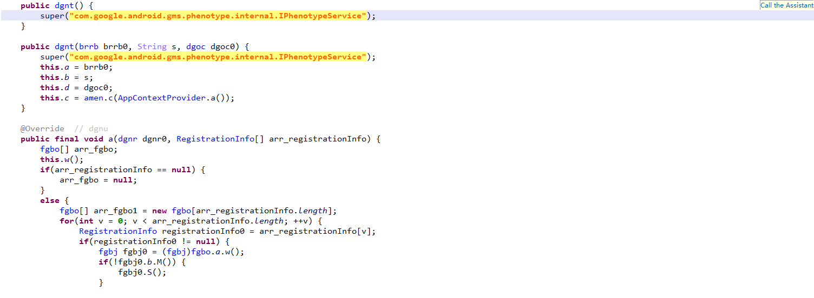
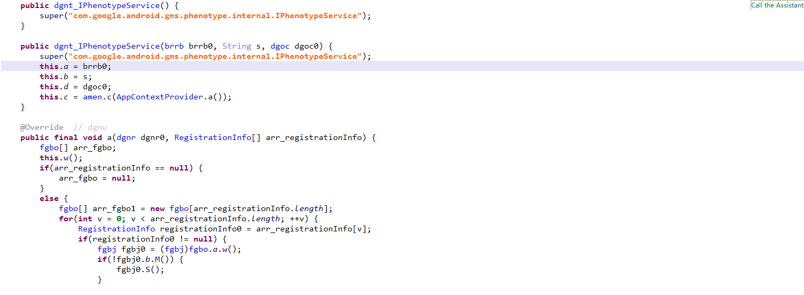
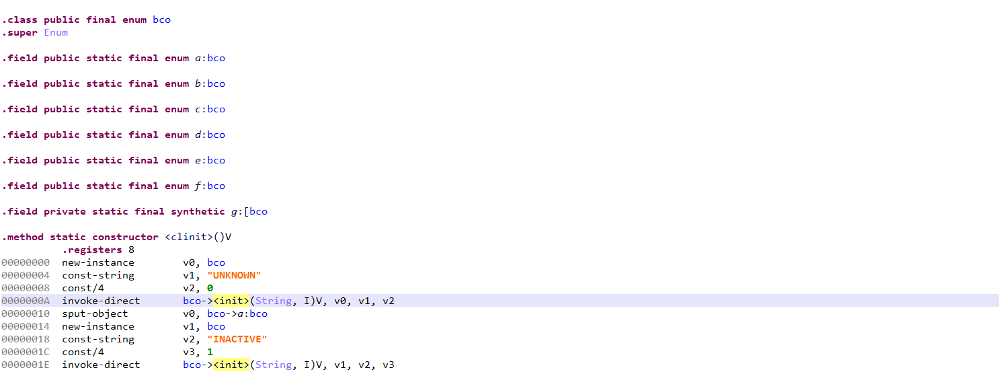
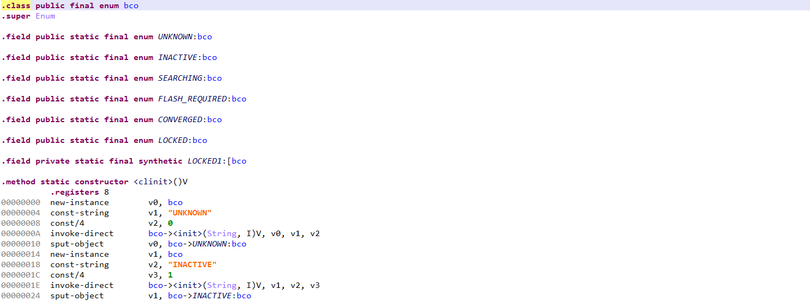
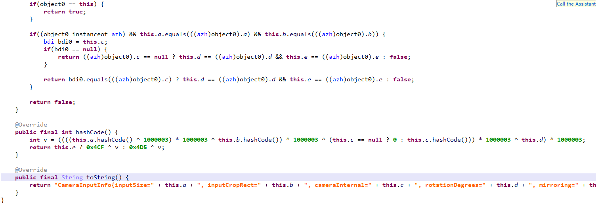
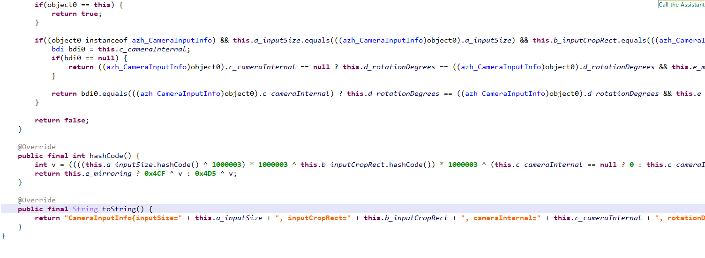
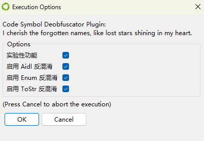

# JEB Plugin - Deobfuscated Helper

这是一个为 [JEB Decompiler](https://www.pnfsoftware.com/jeb/) 开发的插件，是一个为 JEB 反编译器设计的 Java 插件，旨在辅助逆向工程人员在分析混淆或重命名的 APK/Dex 文件时，提高代码可读性和分析效率。该插件通过自动提取关键上下文信息、还原类/方法/字段名称、识别特征模式，帮助用户在 JEB GUI 中更直观地理解目标代码结构。

本项目仅提供 **预构建 jar 包**，不包含源码。

## 🔧 功能介绍

- 自动识别并还原常见字段、方法、类的语义名称
- 支持基于 toString、反射调用、Protobuf 描述符恢复字段符号
- 可识别 Kotlin Metadata 并提取原始结构
- 可扩展的插件框架，适配更多规则逻辑

## 🖼️ 插件效果

下图展示了插件运行后自动重命名混淆类字段的效果（JEB GUI 中）：

aidl优化效果

  
  
enum优化效果

toString优化效果

> 示例展示了三种类型恢复符号方式输出字段名称推测的能力
> 1. aidl 从构造方法的字符串推断出正确的包名和类名并进行修正
> 2. enum 从构造方法的字符串推断出正确的字段符号并进行修正
> 3. toString 寄存器数据流中提取字段符号并修正

## 🛠️ 期待未来变化
> Protobuf 字段符号批量恢复 + Parcelable 源文件还原

## 🚀 安装与使用

1. 下载预构建 jar 包：
   ObfuscatedSymbolRecover-[version]-r8.jar
   token.dat

2. 将 jar 包和 token.dat 复制到 JEB 插件目录：
    JEB 安装目录/coreplugins/

3. 重启 JEB，插件将自动加载并在分析过程中运行。
4. 打开一个Apk文件，点击 Files -> Plugins -> Execute an Engines Plugin -> Code Symbol Deobfuscated Plugin

实验性开关：
是用来控制 ToString 优化模式的开关。
传统模式：使用正常的指令匹配机制匹配 toString 方法中的指令，效果良好。
传统模式缺陷：由于采用的固定指令匹配机制，在遇到非正常模板的指令后无法正常识别出字段原本的符号！

实验性功能：基于寄存器记忆机制，采用实时跟踪寄存器的变化来寻找真实字段的符号，效果优于传统模式，但是有可能有意想不到的问题。

Aidl / Enum / ToString 还原对应三个优化功能开关，如果关闭则不会进行相应的优化。

